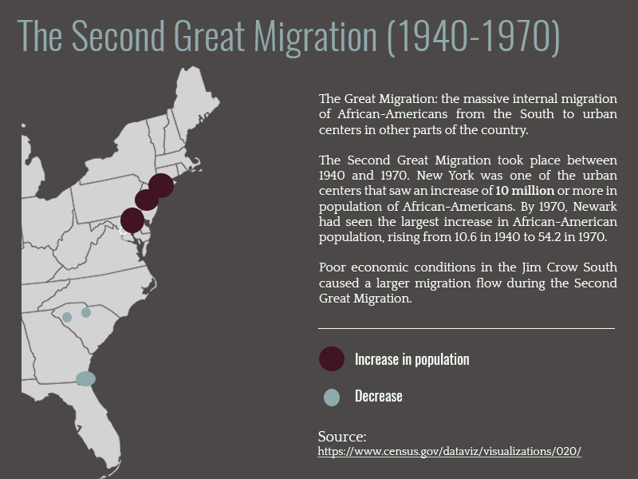
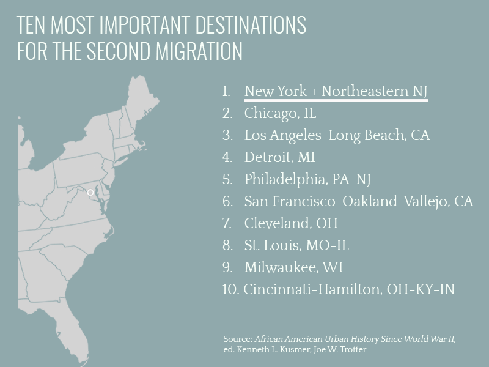

 

 

 <iframe id="player1" src="https://player.vimeo.com/video/214298054?api=1&player_id=player1" width="100%" height="100%"    frameborder="0" webkitallowfullscreen="" mozallowfullscreen="" allowfullscreen=""></iframe>
 

 

 
 

 
<h1>The Great Migration and Its Impact</h1>

By <a href="https://twitter.com/heyyniss">Anissa Pierre</a>

In 1949, 16-year-old Bertha left her small hometown of Mullins, South Carolina to follow her older sister to better economic opportunity in Brooklyn. Unbeknownst to her, she was part of “one of the largest and most rapid mass internal movements in history,” according to Nicholas Lemann in his book “The Promised Land: The Great Black Migration and How It Changed America.”

The Great Migration occurred between 1910 and 1970. During this time over 6 million African Americans moved from the south to urban centers in the northeast and west. The movement is thought of in two waves: the first from 1910 to 1940 and the second from 1940 through 1970. 

 
 

 

 
 

 
 

 
Bertha and her siblings worked on their father’s sharecropped farm, growing and selling cucumbers.

For many farmers in the late nineteenth to mid twentieth century, sharecropping was a vicious cycle. Sharecropping was a system used after the abolishment of slavery in which landowners would rent parts of their farms out to tenants who would then share the profit from the crop with the landlord. The tenants, however, often went into debt to their landlords by renting equipment and borrowing money for seeds, and unpredictable harvesting seasons.

Instead of working to make a profit, many sharecroppers worked to pay off their debts. When the next season came, they went into debt again.

As harvesting progressed, Whitney and her siblings moved to other farms to make extra money for school clothes and supplies. On days it rained they went to school, otherwise it wasn’t until December when harvesting season was over, that they regularly attended school.

Despite the odds, Bertha was eligible for early graduation. Two months later she followed her sister to Brooklyn.

 

