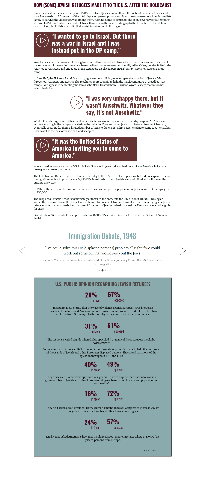

<html>
<head>
  <meta charset="UTF-8">
  <title>Rosa</title>
  <link rel="stylesheet" type="text/css" href="styles/style.css">
  
  
  

</head>
<body>

  <iframe id="player1" src="https://player.vimeo.com/video/210800050?api=1&player_id=player1" width="100%" height="100%" frameborder="0" webkitallowfullscreen="" mozallowfullscreen="" allowfullscreen=""></iframe>

  

</body>
</html>
